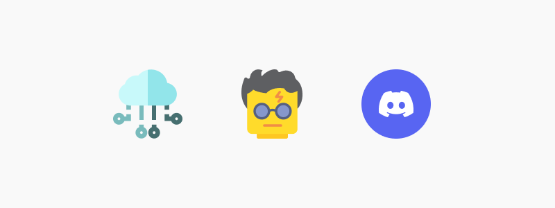

## DialoGPT Discord Chatbot

---

### Description

Harry Potter Chatbot trained using Microsoft DialoGPT wrote in python and actually running on Discord.

### Step by Step

1. **Gather data**

    The dataset used to train the model was a transcription of Harry Potter's first movie which can be found in this [Kaggle link.](https://www.kaggle.com/datasets/gulsahdemiryurek/harry-potter-dataset?select=Harry+Potter+1.csv)

    But you can choose any character you want, you'll only need a csv dataset which contains a column of characters names and a column of speech lines.

     
1. **Train and deploy the model**

    To train the model I've used the notebook that can be found in /training-model folder extracted from [this repo](https://github.com/RuolinZheng08/twewy-discord-chatbot) used in freecodecamp tutorial.

    I have run the notebook in Google Colab and it uses Microsoft DialoGPT (a pretrained response generation model) to train the model using the Harry Potter dataset. After training, I uploaded it to my HuggingFace repo.
     

    You can directly chat with the model hosted on my [Hugging Face's Model Hub.](https://huggingface.co/pedrobaiainin/DialoGPT-small-harrypotter)
     

1. **Build the bot in python**
    In here, I used the discord module to create a new client to the bot and used a HuggingFace inference api URL to connect the bot processing response to the trained model.

    The code can be found in /keep-bot-alive/main.py file.

     

1. **Keep the bot up**

    I used an Replit free account to keep bot alive.

    Basically, you create a new python project on platform and import the 2 files found on /keep-bot-alive folder, the 'main' one is the bot itself and the 'keep-alive' creates a new Flask server. Then you may set your env variables properly and run it to deploy!
